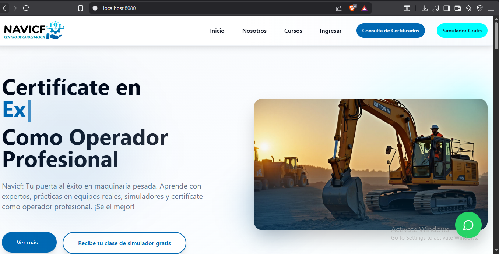
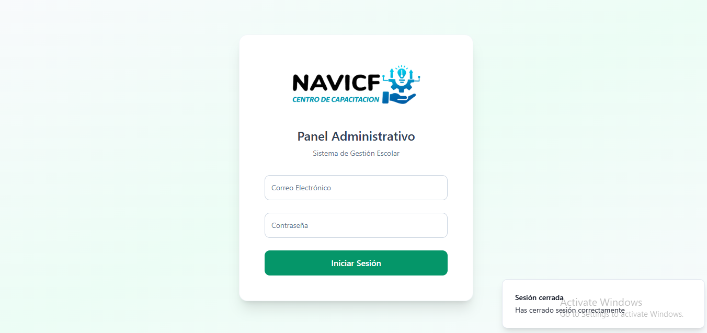
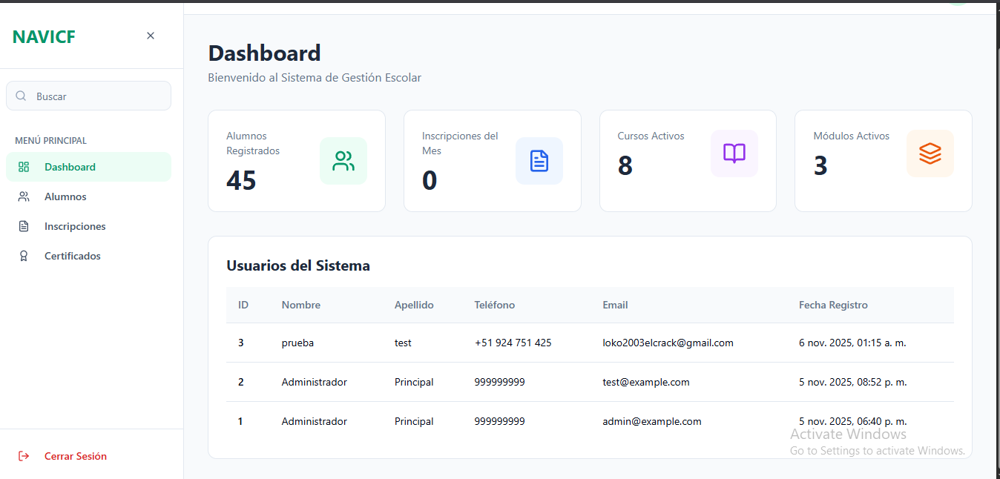

# 🎓 Sistema de Gestión de Alumnos

---

## 📝 Descripción del Proyecto

Este proyecto corresponde a un **Sistema de Gestión de Alumnos**, desarrollado con el objetivo de **administrar, registrar y consultar información académica** de manera ordenada y eficiente.

El sistema fue creado como **proyecto académico**, enfocado en aplicar buenas prácticas de análisis, diseño de sistemas y organización de la información, evitando una implementación básica y buscando una solución más completa y escalable.

---

## 🎯 Objetivo del Sistema

Desarrollar un sistema que permita:

- Registrar alumnos de forma segura  
- Gestionar información académica  
- Facilitar la administración de datos estudiantiles  
- Optimizar el control y consulta de alumnos  

---

## ⚙️ Tecnologías Utilizadas

  
  
  

- 🧠 **Arquitectura:** Cliente – Servidor  
- 🗄️ **Base de datos:** Relacional / No Relacional  
- 🔐 **Autenticación:** Control de acceso por roles  
- 📊 **Gestión de datos:** CRUD completo  
- ☁️ **Almacenamiento:** Plataforma en la nube  

---

## 🚀 Funcionalidades Principales

### 👨‍🎓 Módulo Alumnos
- Registro de alumnos  
- Actualización de datos personales  
- Eliminación lógica de registros  
- Visualización de listado de alumnos  
- Búsqueda por nombre, correo o código  

---

### 🧑‍💼 Módulo Administrativo
- Acceso restringido para administradores  
- Gestión de usuarios del sistema  
- Control y mantenimiento de registros  
- Supervisión general del sistema  

---

## 🌟 Funcionalidades Extras del Sistema

### 📸 Gestión de Imágenes
- Asociación de imágenes a perfiles de alumnos  
- Visualización de fotos en el sistema  

---

### 📄 Reportes
- Generación de reportes generales  
- Resumen de alumnos registrados  
- Exportación de información  

---

### 🔐 Seguridad
- Autenticación de usuarios  
- Validación de datos  
- Protección de información sensible  

---

## 🖼️ Capturas del Sistema

| Módulo | Vista |
|-------|-------|
| 🏠 Inicio de sesión |  |
| 👨‍🎓 Registro de alumnos |  |
| 📋 Listado de alumnos |  |
| 📊 Reportes |  |

---

## 💡 Alcances del Proyecto

- Sistema escalable  
- Fácil mantenimiento  
- Interfaz intuitiva  
- Enfoque académico y administrativo  

---

## 📌 Estado del Proyecto

✅ **Finalizado**  
📚 **Proyecto académico**

---

## 👨‍💻 Autor(es)

- 🧑‍🎓 **[Tu Nombre Aquí]**
- 🏫 Instituto: [Nombre del Instituto]
- 📆 Ciclo: [Ciclo académico]

---

> 📢 *“Un sistema bien diseñado no solo almacena datos, sino que facilita decisiones.”*

---
